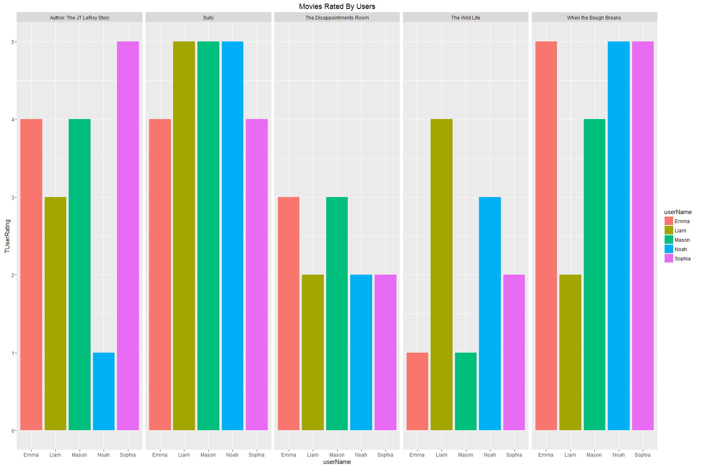

607Week2Assignment
================

Assignment SQL and R
--------------------

Choose six recent popular movies. Ask at least five people that you know (friends, family, classmates, imaginary friends) to rate each of these movie that they have seen on a scale of 1 to 5. Take the results (observations) and store them in a SQL database. Load the information into an R data frame.

Database creation
-----------------

I first created a MySQL database containing 3 tables.

-   User table
-   Movies tables
-   Transaction/fact table


``` r
 # set MySQL information
Yuser = 'root'
Ypassword ='password'
Ydbname ='607week2'
Yhost = 'localhost'

mydb = dbConnect(MySQL(), user= Yuser, password=Ypassword, dbname=Ydbname, host=Yhost)

# List all tables
dbListTables(mydb)
```

    ## [1] "movieinfo"    "tmoviereview" "userinfo"

``` r
# List all columns in each table
dbListFields(mydb, 'movieinfo')
```

    ## [1] "MovieInfoID" "MovieName"

``` r
dbListFields(mydb, 'userinfo')
```

    ## [1] "UserInfoID" "UserName"   "UserSex"

``` r
dbListFields(mydb, 'userinfo')
```

    ## [1] "UserInfoID" "UserName"   "UserSex"

``` r
# Created query to request data
Query = dbSendQuery(mydb, "select userinfo.userName, userinfo.usersex,
                  movieinfo.MovieName,Tmoviereview.TUserRating
                  from userinfo left join tmoviereview 
                 on UserInfoID = TUserInfoID
                 left join movieinfo
                 on TMovieInfoID = MovieInfoID
                    order by userinfo.userName asc")

# Fetched data into data frame
dataFrame = data.frame( fetch(Query, n=-1))

# Description of data
str(dataFrame)
```

    ## 'data.frame':    25 obs. of  4 variables:
    ##  $ userName   : chr  "Emma" "Emma" "Emma" "Emma" ...
    ##  $ usersex    : chr  "F" "F" "F" "F" ...
    ##  $ MovieName  : chr  "Sully" "When the Bough Breaks" "The Disappointments Room" "The Wild Life" ...
    ##  $ TUserRating: int  4 5 3 1 4 5 2 2 4 3 ...

``` r
dataFrame
```

    ##    userName usersex                  MovieName TUserRating
    ## 1      Emma       F                      Sully           4
    ## 2      Emma       F      When the Bough Breaks           5
    ## 3      Emma       F   The Disappointments Room           3
    ## 4      Emma       F              The Wild Life           1
    ## 5      Emma       F Author: The JT LeRoy Story           4
    ## 6      Liam       M                      Sully           5
    ## 7      Liam       M      When the Bough Breaks           2
    ## 8      Liam       M   The Disappointments Room           2
    ## 9      Liam       M              The Wild Life           4
    ## 10     Liam       M Author: The JT LeRoy Story           3
    ## 11    Mason       M                      Sully           5
    ## 12    Mason       M      When the Bough Breaks           4
    ## 13    Mason       M   The Disappointments Room           3
    ## 14    Mason       M              The Wild Life           1
    ## 15    Mason       M Author: The JT LeRoy Story           4
    ## 16     Noah       M                      Sully           5
    ## 17     Noah       M      When the Bough Breaks           5
    ## 18     Noah       M   The Disappointments Room           2
    ## 19     Noah       M              The Wild Life           3
    ## 20     Noah       M Author: The JT LeRoy Story           1
    ## 21   Sophia       F                      Sully           4
    ## 22   Sophia       F      When the Bough Breaks           5
    ## 23   Sophia       F   The Disappointments Room           2
    ## 24   Sophia       F              The Wild Life           2
    ## 25   Sophia       F Author: The JT LeRoy Story           5

Plotting Data
-------------


